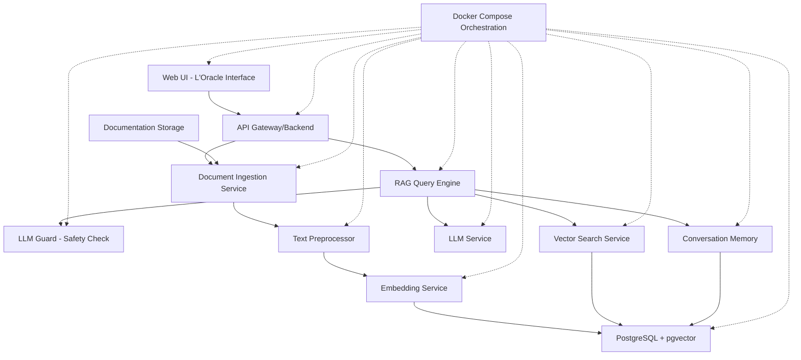
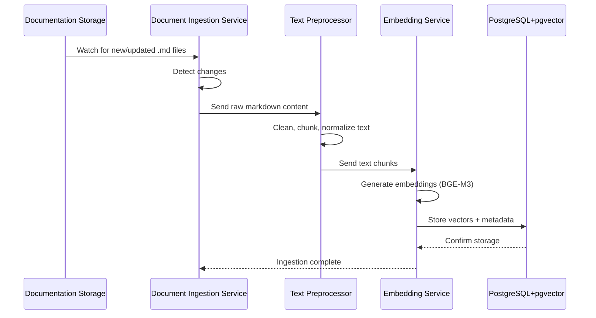
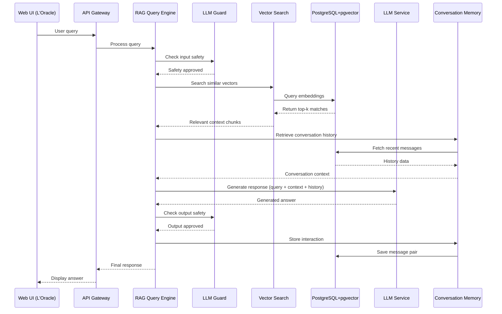

# Design Document: Generic RAG Web Application

## Overview

This design describes a sovereign, self-hosted Retrieval-Augmented Generation (RAG) web application template for softfluid.fr projects. The system ingests markdown documentation, vectorizes it using embedding models, stores vectors in PostgreSQL with pgvector extension, and provides an AI-powered chatbot interface ("L'Oracle") for querying the documentation. The architecture is based on ai-hypervisia but simplified for generic use, eliminating external dependencies like n8n workflow orchestration in favor of internal Python-based processing pipelines.

The application follows a microservices architecture using Docker Compose, with components for document ingestion, text preprocessing, vectorization, vector storage, RAG-based query processing, LLM Guard safety checks, and conversation memory management. All components are containerized and can be deployed on-premises or on sovereign cloud infrastructure, ensuring data privacy and control.

## Architecture




## Main Algorithm/Workflow

### Document Ingestion Flow



### RAG Query Flow




## Components and Interfaces

### Component 1: Document Ingestion Service

**Purpose**: Monitors documentation storage for changes and triggers the ingestion pipeline

**Interface**:
```python
from typing import List, Dict
from pathlib import Path

class DocumentIngestionService:
    def watch_directory(self, path: Path) -> None:
        """Monitor directory for markdown file changes"""
        pass
    
    def ingest_document(self, file_path: Path) -> Dict[str, any]:
        """Process a single document through the pipeline"""
        pass
    
    def batch_ingest(self, file_paths: List[Path]) -> List[Dict[str, any]]:
        """Process multiple documents in batch"""
        pass
```

**Responsibilities**:
- Monitor documentation directory for file changes (create, update, delete)
- Trigger preprocessing pipeline for new/updated documents
- Handle batch ingestion on startup
- Manage ingestion queue and retry logic
- Track ingestion status and errors

### Component 2: Text Preprocessor

**Purpose**: Cleans, chunks, and normalizes markdown content for vectorization

**Interface**:
```python
from typing import List, Dict

class TextPreprocessor:
    def clean_markdown(self, content: str) -> str:
        """Remove formatting, normalize whitespace"""
        pass
    
    def chunk_text(self, content: str, chunk_size: int = 512, overlap: int = 50) -> List[str]:
        """Split text into overlapping chunks"""
        pass
    
    def extract_metadata(self, content: str, file_path: str) -> Dict[str, any]:
        """Extract title, headers, tags from markdown"""
        pass
```

**Responsibilities**:
- Strip markdown formatting while preserving semantic structure
- Split documents into semantic chunks with overlap
- Extract metadata (title, headers, tags, dates)
- Normalize text (lowercase, remove special chars where appropriate)
- Handle code blocks and special markdown elements


### Component 3: Embedding Service

**Purpose**: Generates vector embeddings using BGE-M3 or similar models

**Interface**:
```python
from typing import List
import numpy as np

class EmbeddingService:
    def __init__(self, model_name: str = "BAAI/bge-m3"):
        """Initialize embedding model"""
        pass
    
    def embed_text(self, text: str) -> np.ndarray:
        """Generate embedding for single text"""
        pass
    
    def embed_batch(self, texts: List[str]) -> List[np.ndarray]:
        """Generate embeddings for multiple texts"""
        pass
    
    def get_embedding_dimension(self) -> int:
        """Return embedding vector dimension"""
        pass
```

**Responsibilities**:
- Load and manage embedding model (BGE-M3)
- Generate dense vector representations of text
- Batch processing for efficiency
- Handle model caching and GPU acceleration if available
- Normalize embeddings for cosine similarity

### Component 4: Vector Search Service

**Purpose**: Performs similarity search in PostgreSQL pgvector database

**Interface**:
```python
from typing import List, Dict, Tuple
import numpy as np

class VectorSearchService:
    def search_similar(
        self, 
        query_vector: np.ndarray, 
        top_k: int = 5,
        threshold: float = 0.7
    ) -> List[Dict[str, any]]:
        """Find top-k most similar documents"""
        pass
    
    def hybrid_search(
        self,
        query_vector: np.ndarray,
        keywords: List[str],
        top_k: int = 5
    ) -> List[Dict[str, any]]:
        """Combine vector and keyword search"""
        pass
    
    def store_embedding(
        self,
        text: str,
        vector: np.ndarray,
        metadata: Dict[str, any]
    ) -> str:
        """Store text chunk with embedding and metadata"""
        pass
```

**Responsibilities**:
- Execute vector similarity queries using pgvector
- Combine vector search with keyword filtering
- Store embeddings with associated text and metadata
- Manage vector indexes for performance
- Handle similarity threshold filtering


### Component 5: RAG Query Engine

**Purpose**: Orchestrates the RAG pipeline from query to response

**Interface**:
```python
from typing import Dict, List, Optional

class RAGQueryEngine:
    def process_query(
        self,
        query: str,
        conversation_id: Optional[str] = None,
        top_k: int = 5
    ) -> Dict[str, any]:
        """Process user query through RAG pipeline"""
        pass
    
    def build_prompt(
        self,
        query: str,
        context_chunks: List[str],
        conversation_history: List[Dict[str, str]]
    ) -> str:
        """Construct LLM prompt with context"""
        pass
    
    def stream_response(
        self,
        query: str,
        conversation_id: Optional[str] = None
    ):
        """Stream LLM response in real-time"""
        pass
```

**Responsibilities**:
- Coordinate all RAG pipeline components
- Embed user queries and retrieve relevant context
- Build prompts with context and conversation history
- Call LLM service for response generation
- Apply LLM Guard safety checks
- Manage conversation state
- Return structured responses with sources

### Component 6: LLM Guard Service

**Purpose**: Validates input/output safety and filters harmful content

**Interface**:
```python
from typing import Dict, Tuple

class LLMGuardService:
    def check_input(self, text: str) -> Tuple[bool, str]:
        """Validate user input safety"""
        pass
    
    def check_output(self, text: str) -> Tuple[bool, str]:
        """Validate LLM output safety"""
        pass
    
    def sanitize_text(self, text: str) -> str:
        """Remove or mask sensitive information"""
        pass
```

**Responsibilities**:
- Detect prompt injection attempts
- Filter toxic, harmful, or inappropriate content
- Check for PII leakage
- Validate output relevance and safety
- Apply content policies
- Log security events


### Component 7: Conversation Memory Service

**Purpose**: Manages conversation history and context

**Interface**:
```python
from typing import List, Dict, Optional
from datetime import datetime

class ConversationMemoryService:
    def create_conversation(self, user_id: str) -> str:
        """Create new conversation session"""
        pass
    
    def add_message(
        self,
        conversation_id: str,
        role: str,
        content: str,
        metadata: Optional[Dict] = None
    ) -> None:
        """Add message to conversation"""
        pass
    
    def get_history(
        self,
        conversation_id: str,
        limit: int = 10
    ) -> List[Dict[str, any]]:
        """Retrieve recent conversation history"""
        pass
    
    def summarize_conversation(self, conversation_id: str) -> str:
        """Generate conversation summary for context compression"""
        pass
```

**Responsibilities**:
- Store conversation messages in PostgreSQL
- Retrieve conversation history with pagination
- Manage conversation sessions and expiration
- Compress long conversations using summarization
- Track conversation metadata (timestamps, user info)

### Component 8: LLM Service

**Purpose**: Interfaces with language model for response generation

**Interface**:
```python
from typing import List, Dict, Iterator

class LLMService:
    def __init__(self, model_name: str = "mistral-7b-instruct"):
        """Initialize LLM model"""
        pass
    
    def generate(
        self,
        prompt: str,
        max_tokens: int = 512,
        temperature: float = 0.7
    ) -> str:
        """Generate response from prompt"""
        pass
    
    def generate_stream(
        self,
        prompt: str,
        max_tokens: int = 512
    ) -> Iterator[str]:
        """Stream response tokens"""
        pass
```

**Responsibilities**:
- Load and manage LLM model (local or API)
- Generate responses from prompts
- Support streaming responses
- Handle model parameters (temperature, top_p, etc.)
- Manage model caching and optimization


### Component 9: API Gateway/Backend

**Purpose**: REST API for frontend communication

**Interface**:
```python
from fastapi import FastAPI, HTTPException
from pydantic import BaseModel

class QueryRequest(BaseModel):
    query: str
    conversation_id: Optional[str] = None
    top_k: int = 5

class QueryResponse(BaseModel):
    answer: str
    sources: List[Dict[str, any]]
    conversation_id: str

app = FastAPI()

@app.post("/api/query", response_model=QueryResponse)
async def query(request: QueryRequest) -> QueryResponse:
    """Process user query"""
    pass

@app.post("/api/ingest")
async def ingest_documents() -> Dict[str, str]:
    """Trigger document ingestion"""
    pass

@app.get("/api/conversations/{conversation_id}")
async def get_conversation(conversation_id: str) -> List[Dict]:
    """Retrieve conversation history"""
    pass
```

**Responsibilities**:
- Expose REST API endpoints
- Handle authentication and authorization
- Validate request/response schemas
- Route requests to appropriate services
- Handle errors and return proper HTTP status codes
- Support WebSocket for streaming responses

### Component 10: Web UI (L'Oracle Interface)

**Purpose**: User-facing chat interface for querying documentation

**Interface**:
```typescript
interface Message {
  role: 'user' | 'assistant';
  content: string;
  timestamp: Date;
  sources?: Source[];
}

interface Source {
  title: string;
  excerpt: string;
  url: string;
  similarity: number;
}

class OracleInterface {
  sendQuery(query: string): Promise<Message>;
  streamQuery(query: string): AsyncIterator<string>;
  getConversationHistory(): Promise<Message[]>;
  clearConversation(): void;
}
```

**Responsibilities**:
- Render chat interface with message history
- Send queries to backend API
- Display streaming responses in real-time
- Show source citations with similarity scores
- Handle conversation management (new, clear, history)
- Provide responsive design for mobile/desktop


## Data Models

### Model 1: Document

```python
from dataclasses import dataclass
from datetime import datetime
from typing import Optional

@dataclass
class Document:
    id: str
    file_path: str
    title: str
    content: str
    metadata: dict
    created_at: datetime
    updated_at: datetime
    ingestion_status: str  # 'pending', 'processing', 'completed', 'failed'
```

**Validation Rules**:
- `id` must be unique UUID
- `file_path` must be valid path to markdown file
- `title` extracted from first H1 or filename
- `content` must be non-empty string
- `ingestion_status` must be one of allowed values

### Model 2: TextChunk

```python
from dataclasses import dataclass
import numpy as np

@dataclass
class TextChunk:
    id: str
    document_id: str
    chunk_index: int
    text: str
    embedding: np.ndarray
    metadata: dict
    created_at: datetime
```

**Validation Rules**:
- `id` must be unique UUID
- `document_id` must reference existing document
- `chunk_index` must be non-negative integer
- `text` length must be within chunk_size limits
- `embedding` dimension must match model output (e.g., 1024 for BGE-M3)

### Model 3: Conversation

```python
from dataclasses import dataclass
from typing import List

@dataclass
class Conversation:
    id: str
    user_id: str
    created_at: datetime
    updated_at: datetime
    messages: List['Message']
    metadata: dict
```

**Validation Rules**:
- `id` must be unique UUID
- `user_id` must reference valid user (or 'anonymous')
- `messages` ordered by timestamp
- Conversation expires after configurable period (e.g., 24 hours)


### Model 4: Message

```python
from dataclasses import dataclass
from typing import Optional, List

@dataclass
class Message:
    id: str
    conversation_id: str
    role: str  # 'user' or 'assistant'
    content: str
    sources: Optional[List['Source']]
    timestamp: datetime
    metadata: dict
```

**Validation Rules**:
- `id` must be unique UUID
- `conversation_id` must reference existing conversation
- `role` must be 'user' or 'assistant'
- `content` must be non-empty string
- `sources` only present for assistant messages
- `timestamp` must be valid datetime

### Model 5: Source

```python
from dataclasses import dataclass

@dataclass
class Source:
    chunk_id: str
    document_id: str
    title: str
    excerpt: str
    file_path: str
    similarity_score: float
```

**Validation Rules**:
- `chunk_id` must reference existing text chunk
- `document_id` must reference existing document
- `excerpt` should be truncated to reasonable length (e.g., 200 chars)
- `similarity_score` must be between 0.0 and 1.0

### Model 6: IngestionJob

```python
from dataclasses import dataclass
from typing import Optional

@dataclass
class IngestionJob:
    id: str
    file_path: str
    status: str  # 'queued', 'processing', 'completed', 'failed'
    started_at: Optional[datetime]
    completed_at: Optional[datetime]
    error_message: Optional[str]
    chunks_created: int
```

**Validation Rules**:
- `id` must be unique UUID
- `status` must be one of allowed values
- `completed_at` must be after `started_at`
- `chunks_created` must be non-negative integer
- `error_message` only present when status is 'failed'


## Algorithmic Pseudocode

### Main Processing Algorithm: Document Ingestion Pipeline

```python
def ingest_document_pipeline(file_path: Path) -> IngestionJob:
    """
    Complete document ingestion pipeline from file to vector storage
    
    Preconditions:
    - file_path exists and is readable
    - file_path points to valid markdown file
    - PostgreSQL database is accessible
    - Embedding service is initialized
    
    Postconditions:
    - Document is stored in database
    - All text chunks are vectorized and stored
    - IngestionJob status is 'completed' or 'failed'
    - If successful: chunks_created > 0
    
    Loop Invariants:
    - All processed chunks have valid embeddings
    - Database remains in consistent state
    """
    
    # Step 1: Create ingestion job
    job = create_ingestion_job(file_path)
    job.status = 'processing'
    job.started_at = datetime.now()
    
    try:
        # Step 2: Read and parse markdown file
        content = read_file(file_path)
        assert content is not None and len(content) > 0
        
        # Step 3: Extract metadata
        metadata = extract_metadata(content, file_path)
        
        # Step 4: Create document record
        document = Document(
            id=generate_uuid(),
            file_path=str(file_path),
            title=metadata.get('title', file_path.stem),
            content=content,
            metadata=metadata,
            created_at=datetime.now(),
            updated_at=datetime.now(),
            ingestion_status='processing'
        )
        save_document(document)
        
        # Step 5: Preprocess and chunk text
        cleaned_text = clean_markdown(content)
        chunks = chunk_text(cleaned_text, chunk_size=512, overlap=50)
        assert len(chunks) > 0
        
        # Step 6: Generate embeddings and store chunks
        chunks_created = 0
        for idx, chunk_text in enumerate(chunks):
            # Loop invariant: all previous chunks stored successfully
            assert chunks_created == idx
            
            # Generate embedding
            embedding = embedding_service.embed_text(chunk_text)
            assert embedding.shape[0] == EMBEDDING_DIMENSION
            
            # Create and store chunk
            chunk = TextChunk(
                id=generate_uuid(),
                document_id=document.id,
                chunk_index=idx,
                text=chunk_text,
                embedding=embedding,
                metadata={'document_title': document.title},
                created_at=datetime.now()
            )
            store_chunk_with_embedding(chunk)
            chunks_created += 1
        
        # Step 7: Update document and job status
        document.ingestion_status = 'completed'
        update_document(document)
        
        job.status = 'completed'
        job.completed_at = datetime.now()
        job.chunks_created = chunks_created
        
    except Exception as e:
        # Handle errors
        job.status = 'failed'
        job.completed_at = datetime.now()
        job.error_message = str(e)
        
        if 'document' in locals():
            document.ingestion_status = 'failed'
            update_document(document)
    
    finally:
        save_ingestion_job(job)
    
    return job
```


### RAG Query Processing Algorithm

```python
def process_rag_query(
    query: str,
    conversation_id: Optional[str] = None,
    top_k: int = 5
) -> QueryResponse:
    """
    Process user query through RAG pipeline
    
    Preconditions:
    - query is non-empty string
    - top_k is positive integer
    - If conversation_id provided, conversation exists
    - All services (LLM Guard, Vector Search, LLM) are available
    
    Postconditions:
    - Returns QueryResponse with answer and sources
    - Query and response stored in conversation history
    - All safety checks passed
    - sources list length <= top_k
    
    Loop Invariants:
    - All retrieved sources have similarity >= threshold
    - Conversation state remains consistent
    """
    
    # Step 1: Input safety check
    is_safe, reason = llm_guard.check_input(query)
    if not is_safe:
        raise SecurityException(f"Unsafe input: {reason}")
    
    # Step 2: Get or create conversation
    if conversation_id is None:
        conversation_id = conversation_memory.create_conversation(user_id='anonymous')
    
    assert conversation_exists(conversation_id)
    
    # Step 3: Retrieve conversation history
    history = conversation_memory.get_history(conversation_id, limit=10)
    
    # Step 4: Generate query embedding
    query_embedding = embedding_service.embed_text(query)
    assert query_embedding.shape[0] == EMBEDDING_DIMENSION
    
    # Step 5: Vector similarity search
    similar_chunks = vector_search.search_similar(
        query_vector=query_embedding,
        top_k=top_k,
        threshold=0.7
    )
    
    # Loop invariant: all chunks have similarity >= 0.7
    for chunk in similar_chunks:
        assert chunk['similarity_score'] >= 0.7
    
    # Step 6: Build context from retrieved chunks
    context_texts = [chunk['text'] for chunk in similar_chunks]
    sources = [
        Source(
            chunk_id=chunk['id'],
            document_id=chunk['document_id'],
            title=chunk['metadata']['document_title'],
            excerpt=chunk['text'][:200],
            file_path=chunk['metadata'].get('file_path', ''),
            similarity_score=chunk['similarity_score']
        )
        for chunk in similar_chunks
    ]
    
    # Step 7: Build LLM prompt
    prompt = build_rag_prompt(
        query=query,
        context_chunks=context_texts,
        conversation_history=history
    )
    
    # Step 8: Generate LLM response
    llm_response = llm_service.generate(
        prompt=prompt,
        max_tokens=512,
        temperature=0.7
    )
    
    # Step 9: Output safety check
    is_safe, reason = llm_guard.check_output(llm_response)
    if not is_safe:
        llm_response = "I cannot provide that information due to safety policies."
        sources = []
    
    # Step 10: Store conversation messages
    conversation_memory.add_message(
        conversation_id=conversation_id,
        role='user',
        content=query,
        metadata={'timestamp': datetime.now()}
    )
    
    conversation_memory.add_message(
        conversation_id=conversation_id,
        role='assistant',
        content=llm_response,
        metadata={
            'sources': [s.chunk_id for s in sources],
            'timestamp': datetime.now()
        }
    )
    
    # Step 11: Return response
    response = QueryResponse(
        answer=llm_response,
        sources=[s.__dict__ for s in sources],
        conversation_id=conversation_id
    )
    
    assert len(response.sources) <= top_k
    return response
```


### Text Chunking Algorithm

```python
def chunk_text(
    content: str,
    chunk_size: int = 512,
    overlap: int = 50
) -> List[str]:
    """
    Split text into overlapping chunks for embedding
    
    Preconditions:
    - content is non-empty string
    - chunk_size > overlap > 0
    - overlap < chunk_size
    
    Postconditions:
    - Returns list of text chunks
    - Each chunk length <= chunk_size (in tokens)
    - Adjacent chunks overlap by ~overlap tokens
    - All content is covered (no text lost)
    - len(chunks) >= 1
    
    Loop Invariants:
    - All created chunks have valid length
    - Total coverage increases monotonically
    - No duplicate chunks
    """
    
    assert len(content) > 0
    assert chunk_size > overlap > 0
    
    # Step 1: Tokenize content
    tokens = tokenize(content)
    total_tokens = len(tokens)
    
    if total_tokens <= chunk_size:
        # Single chunk case
        return [content]
    
    # Step 2: Calculate chunk boundaries
    chunks = []
    start_idx = 0
    
    while start_idx < total_tokens:
        # Loop invariant: start_idx is valid position
        assert 0 <= start_idx < total_tokens
        
        # Calculate end position
        end_idx = min(start_idx + chunk_size, total_tokens)
        
        # Extract chunk tokens
        chunk_tokens = tokens[start_idx:end_idx]
        
        # Convert back to text
        chunk_text = detokenize(chunk_tokens)
        
        # Validate chunk
        assert len(chunk_tokens) <= chunk_size
        assert len(chunk_text) > 0
        
        chunks.append(chunk_text)
        
        # Move to next chunk with overlap
        if end_idx >= total_tokens:
            break
        
        start_idx = end_idx - overlap
    
    # Postcondition checks
    assert len(chunks) >= 1
    assert all(len(tokenize(chunk)) <= chunk_size for chunk in chunks)
    
    return chunks
```


### Vector Similarity Search Algorithm

```python
def search_similar_vectors(
    query_vector: np.ndarray,
    top_k: int = 5,
    threshold: float = 0.7
) -> List[Dict[str, any]]:
    """
    Find most similar text chunks using cosine similarity
    
    Preconditions:
    - query_vector.shape[0] == EMBEDDING_DIMENSION
    - top_k > 0
    - 0.0 <= threshold <= 1.0
    - Database connection is active
    
    Postconditions:
    - Returns list of chunks with similarity >= threshold
    - Results sorted by similarity (descending)
    - len(results) <= top_k
    - All similarity scores in [threshold, 1.0]
    
    Loop Invariants:
    - Results remain sorted by similarity
    - All results meet threshold requirement
    """
    
    assert query_vector.shape[0] == EMBEDDING_DIMENSION
    assert top_k > 0
    assert 0.0 <= threshold <= 1.0
    
    # Step 1: Normalize query vector for cosine similarity
    query_norm = query_vector / np.linalg.norm(query_vector)
    
    # Step 2: Execute pgvector similarity search
    # Using cosine distance operator <=>
    sql = """
        SELECT 
            id,
            document_id,
            text,
            metadata,
            1 - (embedding <=> %s::vector) as similarity_score
        FROM text_chunks
        WHERE 1 - (embedding <=> %s::vector) >= %s
        ORDER BY embedding <=> %s::vector
        LIMIT %s
    """
    
    results = execute_query(
        sql,
        params=[query_norm, query_norm, threshold, query_norm, top_k]
    )
    
    # Step 3: Validate and format results
    formatted_results = []
    
    for row in results:
        # Loop invariant: all previous results valid
        assert len(formatted_results) == len([r for r in formatted_results if r['similarity_score'] >= threshold])
        
        similarity = row['similarity_score']
        
        # Validate similarity score
        assert threshold <= similarity <= 1.0
        
        result = {
            'id': row['id'],
            'document_id': row['document_id'],
            'text': row['text'],
            'metadata': row['metadata'],
            'similarity_score': similarity
        }
        
        formatted_results.append(result)
    
    # Postcondition checks
    assert len(formatted_results) <= top_k
    assert all(r['similarity_score'] >= threshold for r in formatted_results)
    
    # Verify sorted order
    for i in range(len(formatted_results) - 1):
        assert formatted_results[i]['similarity_score'] >= formatted_results[i + 1]['similarity_score']
    
    return formatted_results
```


## Key Functions with Formal Specifications

### Function 1: build_rag_prompt()

```python
def build_rag_prompt(
    query: str,
    context_chunks: List[str],
    conversation_history: List[Dict[str, str]]
) -> str:
    """Build LLM prompt with query, context, and history"""
    pass
```

**Preconditions:**
- `query` is non-empty string
- `context_chunks` is list of strings (may be empty)
- `conversation_history` is list of message dicts with 'role' and 'content' keys
- Each history message has valid role ('user' or 'assistant')

**Postconditions:**
- Returns non-empty prompt string
- Prompt contains system instructions
- Prompt includes all context chunks
- Prompt includes conversation history (up to token limit)
- Prompt ends with current user query
- Total prompt length <= MAX_PROMPT_TOKENS

**Loop Invariants:** 
- When iterating through history: accumulated prompt length <= MAX_PROMPT_TOKENS
- All included messages maintain chronological order

### Function 2: clean_markdown()

```python
def clean_markdown(content: str) -> str:
    """Remove markdown formatting while preserving semantic structure"""
    pass
```

**Preconditions:**
- `content` is valid string (may be empty)
- `content` contains markdown-formatted text

**Postconditions:**
- Returns cleaned text string
- Markdown syntax removed (**, __, [], (), etc.)
- Code blocks preserved with language tags
- Headers converted to plain text with context
- Links text preserved, URLs removed
- Multiple whitespaces normalized to single space
- Leading/trailing whitespace removed

**Loop Invariants:** N/A (single-pass processing)


### Function 3: embed_text()

```python
def embed_text(text: str) -> np.ndarray:
    """Generate embedding vector for text using BGE-M3 model"""
    pass
```

**Preconditions:**
- `text` is non-empty string
- `text` length <= MAX_INPUT_LENGTH (e.g., 8192 tokens)
- Embedding model is loaded and initialized

**Postconditions:**
- Returns numpy array of shape (EMBEDDING_DIMENSION,)
- Array dtype is float32
- Vector is normalized (L2 norm ≈ 1.0)
- No NaN or Inf values in output
- Deterministic output for same input text

**Loop Invariants:** N/A (model inference is atomic operation)

### Function 4: check_input_safety()

```python
def check_input_safety(text: str) -> Tuple[bool, str]:
    """Validate user input for safety concerns"""
    pass
```

**Preconditions:**
- `text` is valid string (may be empty)
- Safety rules and patterns are configured

**Postconditions:**
- Returns tuple (is_safe: bool, reason: str)
- If is_safe is True, reason is empty string
- If is_safe is False, reason contains specific violation
- No false negatives for known attack patterns
- Checks include: prompt injection, toxic content, PII leakage

**Loop Invariants:**
- When checking multiple rules: all passed rules remain valid
- First violation stops further checking (early termination)

### Function 5: store_chunk_with_embedding()

```python
def store_chunk_with_embedding(chunk: TextChunk) -> None:
    """Store text chunk with vector embedding in PostgreSQL"""
    pass
```

**Preconditions:**
- `chunk.id` is unique UUID not in database
- `chunk.document_id` references existing document
- `chunk.embedding` has shape (EMBEDDING_DIMENSION,)
- `chunk.text` is non-empty string
- Database connection is active

**Postconditions:**
- Chunk stored in text_chunks table
- Embedding stored in pgvector column
- Transaction committed successfully
- Chunk retrievable by ID
- Vector index updated for similarity search

**Loop Invariants:** N/A (single database transaction)


### Function 6: watch_directory()

```python
def watch_directory(path: Path) -> None:
    """Monitor directory for markdown file changes and trigger ingestion"""
    pass
```

**Preconditions:**
- `path` exists and is a directory
- Process has read permissions on directory
- Ingestion service is initialized

**Postconditions:**
- File system watcher is active
- New/modified .md files trigger ingestion
- Deleted files trigger cleanup
- Watcher runs until explicitly stopped
- All file events are logged

**Loop Invariants:**
- Watcher remains active throughout execution
- Event queue is processed in order
- No events are lost or duplicated

## Example Usage

### Example 1: Document Ingestion

```python
# Initialize services
embedding_service = EmbeddingService(model_name="BAAI/bge-m3")
vector_search = VectorSearchService(db_connection)
ingestion_service = DocumentIngestionService(embedding_service, vector_search)

# Ingest single document
doc_path = Path("/docs/user-guide.md")
job = ingestion_service.ingest_document(doc_path)

if job.status == 'completed':
    print(f"Successfully ingested {job.chunks_created} chunks")
else:
    print(f"Ingestion failed: {job.error_message}")

# Watch directory for changes
ingestion_service.watch_directory(Path("/docs"))
```

### Example 2: RAG Query Processing

```python
# Initialize RAG engine
rag_engine = RAGQueryEngine(
    embedding_service=embedding_service,
    vector_search=vector_search,
    llm_service=llm_service,
    llm_guard=llm_guard,
    conversation_memory=conversation_memory
)

# Process user query
query = "How do I configure authentication?"
response = rag_engine.process_query(
    query=query,
    conversation_id=None,  # Creates new conversation
    top_k=5
)

print(f"Answer: {response.answer}")
print(f"\nSources ({len(response.sources)}):")
for source in response.sources:
    print(f"  - {source.title} (similarity: {source.similarity_score:.2f})")
    print(f"    {source.excerpt}...")
```


### Example 3: Streaming Response

```python
# Stream LLM response in real-time
async def stream_query_example():
    query = "Explain the deployment process"
    
    async for chunk in rag_engine.stream_response(query):
        print(chunk, end='', flush=True)
    
    print()  # New line after streaming complete

# Run async function
import asyncio
asyncio.run(stream_query_example())
```

### Example 4: Conversation Management

```python
# Create conversation and maintain context
conversation_id = conversation_memory.create_conversation(user_id="user123")

# First query
response1 = rag_engine.process_query(
    query="What is RAG?",
    conversation_id=conversation_id
)

# Follow-up query (uses conversation context)
response2 = rag_engine.process_query(
    query="How does it work in this application?",
    conversation_id=conversation_id
)

# Retrieve full conversation history
history = conversation_memory.get_history(conversation_id)
for msg in history:
    print(f"{msg['role']}: {msg['content']}")
```

### Example 5: API Endpoint Usage

```python
# FastAPI endpoint implementation
from fastapi import FastAPI, HTTPException, WebSocket

app = FastAPI()

@app.post("/api/query")
async def query_endpoint(request: QueryRequest) -> QueryResponse:
    try:
        response = rag_engine.process_query(
            query=request.query,
            conversation_id=request.conversation_id,
            top_k=request.top_k
        )
        return response
    except SecurityException as e:
        raise HTTPException(status_code=400, detail=str(e))
    except Exception as e:
        raise HTTPException(status_code=500, detail="Internal server error")

@app.websocket("/ws/query")
async def websocket_query(websocket: WebSocket):
    await websocket.accept()
    
    while True:
        query = await websocket.receive_text()
        
        async for chunk in rag_engine.stream_response(query):
            await websocket.send_text(chunk)
        
        await websocket.send_text("[DONE]")
```


### Example 6: Docker Compose Configuration

```yaml
# docker-compose.yml
version: '3.8'

services:
  postgres:
    image: pgvector/pgvector:pg16
    environment:
      POSTGRES_DB: rag_db
      POSTGRES_USER: rag_user
      POSTGRES_PASSWORD: ${DB_PASSWORD}
    volumes:
      - postgres_data:/var/lib/postgresql/data
      - ./init.sql:/docker-entrypoint-initdb.d/init.sql
    ports:
      - "5432:5432"
    healthcheck:
      test: ["CMD-SHELL", "pg_isready -U rag_user"]
      interval: 10s
      timeout: 5s
      retries: 5

  embedding-service:
    build: ./services/embedding
    environment:
      MODEL_NAME: BAAI/bge-m3
      DEVICE: cuda  # or cpu
    volumes:
      - model_cache:/root/.cache/huggingface
    depends_on:
      postgres:
        condition: service_healthy

  ingestion-service:
    build: ./services/ingestion
    environment:
      DB_HOST: postgres
      DB_NAME: rag_db
      DB_USER: rag_user
      DB_PASSWORD: ${DB_PASSWORD}
      EMBEDDING_SERVICE_URL: http://embedding-service:8000
    volumes:
      - ./docs:/docs:ro
    depends_on:
      - postgres
      - embedding-service

  api-backend:
    build: ./services/api
    environment:
      DB_HOST: postgres
      DB_NAME: rag_db
      DB_USER: rag_user
      DB_PASSWORD: ${DB_PASSWORD}
      EMBEDDING_SERVICE_URL: http://embedding-service:8000
      LLM_SERVICE_URL: http://llm-service:8000
    ports:
      - "8080:8080"
    depends_on:
      - postgres
      - embedding-service
      - llm-service

  llm-service:
    build: ./services/llm
    environment:
      MODEL_NAME: mistralai/Mistral-7B-Instruct-v0.2
      DEVICE: cuda
    volumes:
      - model_cache:/root/.cache/huggingface
    deploy:
      resources:
        reservations:
          devices:
            - driver: nvidia
              count: 1
              capabilities: [gpu]

  web-ui:
    build: ./services/web
    ports:
      - "3000:3000"
    environment:
      API_URL: http://api-backend:8080
    depends_on:
      - api-backend

volumes:
  postgres_data:
  model_cache:
```


## Correctness Properties

*A property is a characteristic or behavior that should hold true across all valid executions of a system—essentially, a formal statement about what the system should do. Properties serve as the bridge between human-readable specifications and machine-verifiable correctness guarantees.*

### Property 1: Embedding Consistency

*For any* text input, embedding the same text multiple times produces identical vectors with constant dimension and no invalid values.

**Validates: Requirements 3.1, 3.2, 3.3, 3.5, 18.2**

### Property 2: Vector Search Correctness

*For any* query vector and similarity threshold, search results contain only chunks meeting the threshold, sorted by similarity in descending order, with count not exceeding top-k.

**Validates: Requirements 5.1, 5.2, 5.3, 5.5**

### Property 3: Conversation Integrity

*For any* conversation, messages are stored and retrieved in chronological order with monotonically increasing timestamps.

**Validates: Requirements 9.2, 9.3, 18.3**

### Property 4: Document Coverage

*For any* document, chunking covers the entire document without loss, with all chunks respecting token limits and proper overlap.

**Validates: Requirements 2.2, 2.5**

### Property 5: Safety Guarantees

*For any* input or output, if safety checks fail, the content is rejected and logged, while safe content passes through to the next stage.

**Validates: Requirements 7.1, 7.2, 7.3, 7.4, 7.5, 8.1, 8.4, 8.5**

### Property 6: Idempotent Ingestion

*For any* document, re-ingesting it replaces old chunks with new ones without creating duplicates.

**Validates: Requirements 1.2, 4.3, 18.4**

### Property 7: Transaction Atomicity

*For any* database operation, either all changes are committed or none are, maintaining referential integrity and data consistency.

**Validates: Requirements 4.4, 13.2, 18.1, 18.5**

### Property 8: Prompt Token Limit

*For any* combination of query, context chunks, and conversation history, the constructed prompt never exceeds MAX_PROMPT_TOKENS.

**Validates: Requirements 6.3, 19.1, 19.4**

### Property 9: Chunk Storage Round-Trip

*For any* text chunk with embedding and metadata, storing it and then retrieving it by ID returns equivalent data.

**Validates: Requirements 4.1, 4.5**

### Property 10: Document Deletion Cleanup

*For any* document that is deleted, all associated chunks are removed from the database with no orphaned data.

**Validates: Requirements 1.3**

### Property 11: Markdown Preprocessing

*For any* markdown content, preprocessing removes formatting while preserving semantic structure, code blocks, and extracting metadata.

**Validates: Requirements 2.1, 2.3, 2.4**

### Property 12: Query Processing Completeness

*For any* user query, the RAG pipeline embeds the query, retrieves context, builds a prompt, generates a response, and stores the interaction in conversation history.

**Validates: Requirements 6.1, 6.2, 6.4, 6.5**

### Property 13: Conversation Session Management

*For any* query without a conversation ID, a new conversation session is created and subsequent messages are associated with that session.

**Validates: Requirements 9.1**

### Property 14: LLM Response Generation

*For any* valid prompt, the LLM service generates a response, with streaming producing the same final output as non-streaming.

**Validates: Requirements 10.1, 10.2**

### Property 15: Access Control Isolation

*For any* user, they can only access their own conversation history and cannot retrieve conversations belonging to other users.

**Validates: Requirements 15.3**

### Property 16: Structured Logging

*For any* operation, events are logged with structured format including timestamps, context, and relevant details, with security events logged separately.

**Validates: Requirements 17.1, 17.5**

### Property 17: Metrics Tracking

*For any* query processed, the system tracks and records latency, throughput, and error rate metrics.

**Validates: Requirements 17.4**

### Property 18: Context Prioritization

*For any* prompt construction, context chunks are ordered by similarity score (highest first) and conversation history includes the most recent messages.

**Validates: Requirements 19.2, 19.3**

### Property 19: Truncation Logging

*For any* prompt that requires truncation to meet token limits, the truncation event is logged for monitoring.

**Validates: Requirements 19.5**

### Property 20: Embedding Batch Consistency

*For any* set of texts, batching them for embedding produces the same vectors as embedding them individually.

**Validates: Requirements 20.3**

### Property 21: Cache Correctness

*For any* query, cached responses are identical to freshly computed responses for the same input.

**Validates: Requirements 14.4**


## Error Handling

### Error Scenario 1: Document Ingestion Failure

**Condition**: File cannot be read, parsed, or processed
**Response**: 
- Log error with file path and exception details
- Set ingestion job status to 'failed'
- Store error message in job record
- Do not create partial document or chunk records
**Recovery**: 
- Retry mechanism with exponential backoff
- Manual re-ingestion trigger via API
- Alert administrator if repeated failures

### Error Scenario 2: Embedding Service Unavailable

**Condition**: Embedding service is down or unresponsive
**Response**:
- Queue ingestion jobs for later processing
- Return 503 Service Unavailable for new queries
- Use circuit breaker pattern to prevent cascading failures
**Recovery**:
- Automatic retry when service becomes available
- Process queued jobs in order
- Health check monitoring with alerts

### Error Scenario 3: Database Connection Lost

**Condition**: PostgreSQL connection drops during operation
**Response**:
- Rollback current transaction
- Log connection error
- Attempt reconnection with exponential backoff
- Return 500 Internal Server Error to client
**Recovery**:
- Connection pool automatically recreates connections
- Retry failed operations after reconnection
- Maintain connection health checks

### Error Scenario 4: LLM Guard Rejection

**Condition**: Input or output fails safety checks
**Response**:
- Log security event with query/response details
- Return generic error message to user (no details)
- Increment security metrics counter
- Do not store rejected interaction in conversation
**Recovery**:
- User can rephrase query
- Administrator reviews security logs
- Update safety rules if false positive

### Error Scenario 5: Vector Search Returns No Results

**Condition**: No chunks meet similarity threshold
**Response**:
- Return response indicating no relevant documentation found
- Suggest query reformulation
- Log low-confidence query for analysis
**Recovery**:
- User rephrases query
- Administrator reviews documentation coverage
- Consider lowering similarity threshold


### Error Scenario 6: Token Limit Exceeded

**Condition**: Prompt or response exceeds model's token limit
**Response**:
- Truncate context chunks to fit within limit
- Prioritize most relevant chunks (highest similarity)
- Trim conversation history if needed
- Log truncation event
**Recovery**:
- Automatic truncation ensures operation continues
- User receives response with available context
- Consider increasing chunk size or reducing top_k

### Error Scenario 7: Concurrent Document Updates

**Condition**: Same document modified while ingestion in progress
**Response**:
- Use file modification timestamp to detect conflicts
- Cancel in-progress ingestion if newer version detected
- Start new ingestion with latest version
**Recovery**:
- Automatic re-ingestion with latest content
- No user intervention required
- Eventual consistency guaranteed

## Testing Strategy

### Unit Testing Approach

Each component has comprehensive unit tests covering:

**Text Preprocessor**:
- Markdown cleaning with various formatting styles
- Chunk boundary edge cases (empty docs, single sentence, very long docs)
- Metadata extraction from different markdown structures
- Token counting accuracy

**Embedding Service**:
- Deterministic output for same input
- Correct embedding dimensions
- Batch processing consistency
- Error handling for invalid inputs

**Vector Search**:
- Similarity threshold filtering
- Top-k result limiting
- Sorting correctness
- Empty result handling

**LLM Guard**:
- Known attack pattern detection (prompt injection, jailbreaks)
- Toxic content filtering
- PII detection and masking
- False positive rate monitoring

**Conversation Memory**:
- Message ordering and retrieval
- Conversation expiration
- Concurrent access handling
- History truncation

**Coverage Goal**: Minimum 80% code coverage for all components


### Property-Based Testing Approach

Use property-based testing to verify correctness properties across wide input ranges.

**Property Test Library**: Hypothesis (Python)

**Key Properties to Test**:

1. **Chunking Coverage Property**:
   - Generate random documents of varying lengths
   - Verify: concatenated chunks (minus overlap) equals original document
   - Verify: all chunks within size limits

2. **Embedding Determinism Property**:
   - Generate random text inputs
   - Verify: embed_text(t) == embed_text(t) for all t
   - Verify: embedding dimension is constant

3. **Vector Search Monotonicity Property**:
   - Generate random query vectors
   - Verify: results[i].similarity >= results[i+1].similarity for all i
   - Verify: all results.similarity >= threshold

4. **Conversation Ordering Property**:
   - Generate random message sequences
   - Verify: retrieved messages maintain insertion order
   - Verify: timestamps are monotonically increasing

5. **Prompt Token Limit Property**:
   - Generate random combinations of query, context, history
   - Verify: build_rag_prompt() output never exceeds MAX_PROMPT_TOKENS
   - Verify: truncation preserves most relevant information

**Example Property Test**:
```python
from hypothesis import given, strategies as st

@given(st.text(min_size=100, max_size=10000))
def test_chunking_coverage(document):
    chunks = chunk_text(document, chunk_size=512, overlap=50)
    
    # Property: All chunks within size limit
    assert all(len(tokenize(chunk)) <= 512 for chunk in chunks)
    
    # Property: No empty chunks
    assert all(len(chunk) > 0 for chunk in chunks)
    
    # Property: At least one chunk produced
    assert len(chunks) >= 1
```

### Integration Testing Approach

Test end-to-end workflows with real components:

**Test Scenario 1: Complete Ingestion Pipeline**:
- Create test markdown files
- Trigger ingestion
- Verify chunks stored in database
- Verify embeddings have correct dimensions
- Verify metadata extracted correctly

**Test Scenario 2: End-to-End RAG Query**:
- Ingest test documentation
- Submit query via API
- Verify response contains relevant information
- Verify sources are cited correctly
- Verify conversation stored

**Test Scenario 3: Conversation Context**:
- Create conversation with multiple turns
- Verify follow-up questions use context
- Verify history retrieval is correct
- Verify conversation expiration

**Test Scenario 4: Safety Checks**:
- Submit known malicious inputs
- Verify rejection by LLM Guard
- Verify no data stored for rejected queries
- Verify appropriate error responses

**Test Environment**: Docker Compose with test database and mock LLM service


## Performance Considerations

### Embedding Generation
- **Batch Processing**: Process multiple chunks in single embedding call (10-50 chunks per batch)
- **GPU Acceleration**: Use CUDA for embedding model inference (10-50x speedup)
- **Model Caching**: Keep embedding model in memory, avoid repeated loading
- **Expected Throughput**: 100-500 chunks/second on GPU, 10-50 chunks/second on CPU

### Vector Search
- **Index Type**: Use HNSW (Hierarchical Navigable Small World) index for pgvector
- **Index Parameters**: 
  - m=16 (connections per layer)
  - ef_construction=64 (build quality)
  - ef_search=40 (search quality)
- **Expected Latency**: <50ms for top-5 search in 100K chunks, <200ms for 1M chunks
- **Scaling**: Horizontal scaling via read replicas for query load

### LLM Inference
- **Model Size**: Use 7B parameter model for balance of quality and speed
- **Quantization**: 4-bit or 8-bit quantization for reduced memory (GPTQ or AWQ)
- **Batching**: Batch multiple queries when possible
- **Expected Latency**: 2-5 seconds for 512 token response on GPU
- **Streaming**: Use streaming to reduce perceived latency

### Database Optimization
- **Connection Pooling**: Maintain pool of 10-20 connections
- **Query Optimization**: Index on document_id, conversation_id, timestamps
- **Partitioning**: Partition text_chunks table by document_id for large datasets
- **Vacuum**: Regular VACUUM ANALYZE for pgvector index maintenance

### Caching Strategy
- **Embedding Cache**: Cache embeddings for frequently queried texts (Redis)
- **Response Cache**: Cache LLM responses for identical queries (TTL: 1 hour)
- **Conversation Cache**: Cache recent conversation history in memory
- **Expected Hit Rate**: 20-40% for embedding cache, 10-20% for response cache

### Scalability Targets
- **Documents**: Support up to 10,000 documents (1M chunks)
- **Concurrent Users**: Handle 100 concurrent queries
- **Query Throughput**: 50-100 queries/second with caching
- **Ingestion Rate**: 1,000 documents/hour


## Security Considerations

### Authentication & Authorization
- **API Authentication**: JWT tokens for API access
- **User Roles**: Admin (full access), User (query only), Anonymous (rate-limited)
- **Token Expiration**: 24-hour access tokens, 30-day refresh tokens
- **Rate Limiting**: 100 queries/hour for anonymous, 1000/hour for authenticated users

### Input Validation
- **Query Length Limits**: Maximum 1000 characters for user queries
- **SQL Injection Prevention**: Use parameterized queries exclusively
- **Path Traversal Prevention**: Validate and sanitize file paths for ingestion
- **XSS Prevention**: Sanitize all user inputs before display

### LLM Guard Security
- **Prompt Injection Detection**: Pattern matching for known injection techniques
- **Toxic Content Filtering**: Use toxicity classifier (threshold: 0.7)
- **PII Detection**: Regex patterns for emails, phone numbers, SSNs, credit cards
- **Output Validation**: Check for leaked system prompts or internal information

### Data Privacy
- **Conversation Isolation**: Users can only access their own conversations
- **Data Retention**: Conversations expire after 30 days (configurable)
- **Audit Logging**: Log all queries, responses, and security events
- **Encryption**: TLS 1.3 for all network communication
- **Database Encryption**: Encrypt sensitive fields at rest

### Infrastructure Security
- **Container Isolation**: Each service runs in isolated container
- **Network Segmentation**: Internal network for service communication
- **Secrets Management**: Use environment variables or secrets manager (not hardcoded)
- **Minimal Privileges**: Services run as non-root users
- **Security Updates**: Regular updates for base images and dependencies

### Threat Mitigation
- **DDoS Protection**: Rate limiting and request throttling
- **Prompt Injection**: Multi-layer detection (input validation + LLM Guard)
- **Data Exfiltration**: Monitor for unusual query patterns
- **Model Poisoning**: Validate and scan uploaded documents
- **Supply Chain**: Pin dependency versions, use trusted registries


## Dependencies

### Core Dependencies

**Python Backend Services**:
- `fastapi==0.109.0` - API framework
- `uvicorn==0.27.0` - ASGI server
- `pydantic==2.5.0` - Data validation
- `sqlalchemy==2.0.25` - Database ORM
- `psycopg2-binary==2.9.9` - PostgreSQL driver
- `pgvector==0.2.4` - PostgreSQL vector extension client
- `python-dotenv==1.0.0` - Environment configuration

**Machine Learning**:
- `torch==2.1.2` - Deep learning framework
- `transformers==4.37.0` - Hugging Face transformers
- `sentence-transformers==2.3.1` - Embedding models
- `FlagEmbedding==1.2.3` - BGE-M3 embedding model
- `accelerate==0.26.1` - Model optimization

**Text Processing**:
- `markdown==3.5.1` - Markdown parsing
- `beautifulsoup4==4.12.3` - HTML/text cleaning
- `tiktoken==0.5.2` - Token counting (OpenAI tokenizer)
- `nltk==3.8.1` - Natural language processing

**LLM & Safety**:
- `vllm==0.2.7` - Fast LLM inference (optional)
- `llm-guard==0.3.0` - Safety checks and filtering
- `detoxify==0.5.1` - Toxicity detection

**Monitoring & Logging**:
- `prometheus-client==0.19.0` - Metrics collection
- `structlog==24.1.0` - Structured logging
- `sentry-sdk==1.40.0` - Error tracking

### Frontend Dependencies

**Web UI (React/TypeScript)**:
- `react==18.2.0` - UI framework
- `typescript==5.3.3` - Type safety
- `vite==5.0.11` - Build tool
- `tailwindcss==3.4.1` - Styling
- `axios==1.6.5` - HTTP client
- `react-markdown==9.0.1` - Markdown rendering
- `@tanstack/react-query==5.17.19` - Data fetching

### Infrastructure Dependencies

**Database**:
- `pgvector/pgvector:pg16` - PostgreSQL with vector extension
- PostgreSQL 16+ with pgvector 0.5.0+

**Container Runtime**:
- Docker 24.0+
- Docker Compose 2.20+

**Optional Cloud Services**:
- Object storage (S3-compatible) for document storage
- Redis for caching
- Prometheus + Grafana for monitoring

### Model Dependencies

**Embedding Model**:
- `BAAI/bge-m3` (2.27 GB) - Multilingual embedding model
- Alternative: `BAAI/bge-base-en-v1.5` (438 MB) for English only

**LLM Model**:
- `mistralai/Mistral-7B-Instruct-v0.2` (14.5 GB) - Instruction-tuned LLM
- Alternative: `TheBloke/Mistral-7B-Instruct-v0.2-GPTQ` (4.7 GB) - Quantized version
- Alternative: OpenAI API, Anthropic API, or other hosted LLM services

### System Requirements

**Minimum (CPU-only)**:
- 16 GB RAM
- 50 GB disk space
- 4 CPU cores

**Recommended (GPU)**:
- 32 GB RAM
- 100 GB disk space
- 8 CPU cores
- NVIDIA GPU with 16+ GB VRAM (RTX 4090, A100, etc.)
- CUDA 12.0+

**Production (High Performance)**:
- 64 GB RAM
- 500 GB SSD storage
- 16+ CPU cores
- NVIDIA GPU with 24+ GB VRAM
- Load balancer for API services
- PostgreSQL with read replicas
